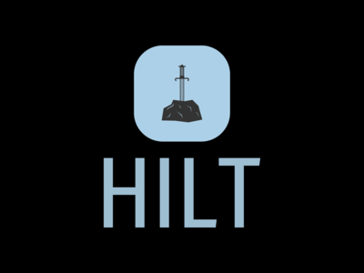

# Hilt


This project is mainly for building a local dev environment

## Directory structure
```
platforms
|
|___+ bookshelf
|   |___+ cheatsheets
|   |___+ libs
|   |___+ setup
|   |___+ draft
|
|___+ compose
|   |___+ base
|   |___+ compute
|   |___+ serving
|   |___+ storage
|   |___- README.md
|   |___- Taskfile.yml
|
|___+ helm
|   |___+ addons
|   |___+ compute
|   |___+ operators
|   |___+ serving
|   |___+ storage
|   |___- helmfile.yaml
|   |___- kustomization.yaml
|   |___- README.md
|   |___- Taskfile.yml
|
|___- README.md

```
- bookshelf
- docker: [Building your environment with docker](./compose/README.md)
  - base: Building your base image that may be helpfull when you want to build your own images
  - computation: Your computation engines, e.g., airflow, nifi, ...
  - databases: Your databases, e.g., mysql, postgresql, ...
  - monitoring: Monitoring platforms, e.g., prometheus, grafana, ...
  - security: Security platforms, e.g., keycloak, vault, ...
  - warehouse: Your warehouse platforms, e.g., hive
  - storage: Your storage platforms, e.g., hadoop, kafka, ...
- minikube: [Building your environment with minikube](./helm/README.md)
  - addons: Minikube addons, e.g., cert-manager
  - operator: K8S operators, e.g., strimzi operator
  - computation: Your computation engines, e.g., airflow, trino, ...
  - databases: Your databases, e.g., mysql, postgresql, ...
  - monitoring: Monitoring platforms, e.g., prometheus, grafana, ...
  - security: Security platforms, e.g., keycloak
  - warehouse: Your warehouse platforms, e.g., hive
  - storage: Your storage platforms, e.g., hadoop, kafka, ...

## Features
1. Local dev/staging environment
2. Simplify platforms configurations
3. Comfort lazy devs (like me)

## Supported services
| Idx | Service | Type | Kubernetes | Docker |
|-----|---------|------|------------|--------|
| 1 | Apache Airflow | Computation | yes | yes |
| 2 | Debezium | Computation / CDC | yes | yes |
| 3 | Apache Nifi | Computation | no | yes |
| 4 | Trino | Computation | yes | yes |
| 5 | Mongo DB | Database | no | yes |
| 6 | Mysql | Database | yes | yes |
| 7 | Postgresql | Database | yes | yes |
| 8 | Rabbit MQ | Database / Key-value store | no | yes |
| 9 | Redis | Database / Key-value store | yes | yes |
| 10 | Grafana | Monitoring | yes | yes |
| 11 | Prometheus | Monitoring | yes | yes |
| 12 | Keycloak | Security | yes | yes |
| 13 | Vault | Security | no | yes |
| 14 | Apache Hadoop | Storage | no | yes |
| 15 | Apache Kafka | Storage | yes | yes |
| 16 | Minio | Storage | yes | yes |
| 17 | Apache Zookeeper | Storage / Coordinator | yes | yes |
| 18 | Apache Hive | Warehouse | yes | yes |
