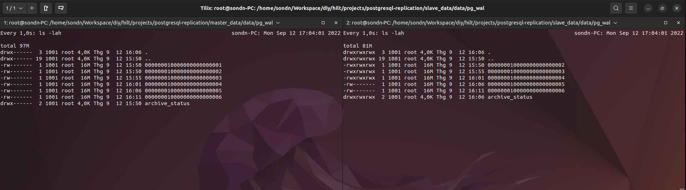
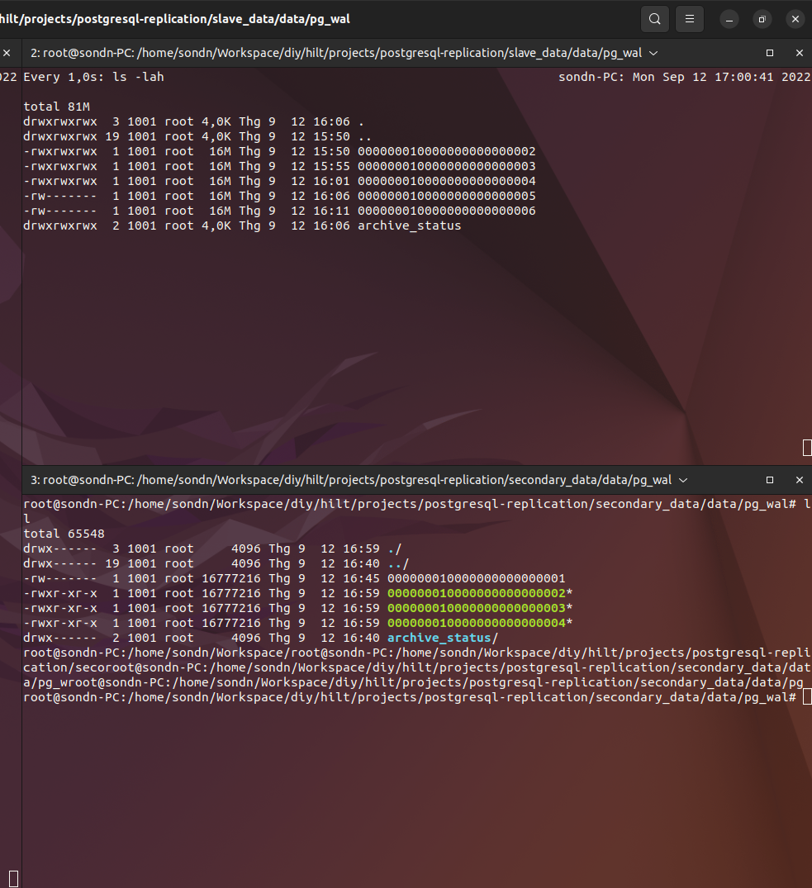
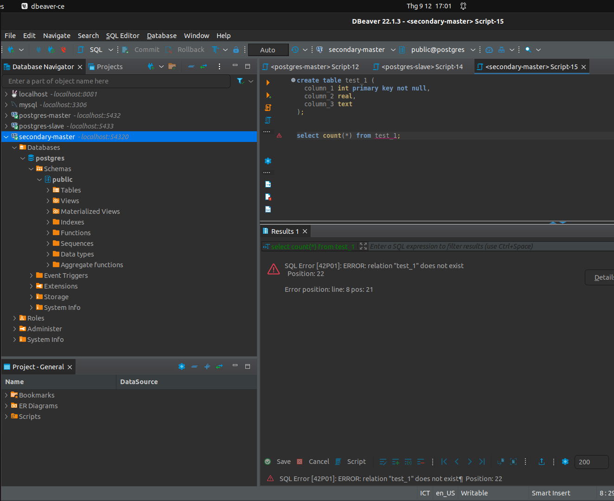

# How debezium connectors for postgresql kick my ass
>## 1. Change data capture from postgresql databases
### 1.1. How postgresql databases replicate change events
See: https://severalnines.com/blog/postgresql-streaming-replication-deep-dive/
### 1.2 Debezium connectors for postgresql
The Debezium PostgreSQL connector captures row-level changes in the schemas of a PostgreSQL database

The first time it connects to a PostgreSQL server or cluster, the connector takes a consistent snapshot of all schemas. After that snapshot is complete, the connector continuously captures row-level changes that insert, update, and delete database content and that were committed to a PostgreSQL database. The connector generates data change event records and streams them to Kafka topics. For each table, the default behavior is that the connector streams all generated events to a separate Kafka topic for that table.

See: https://debezium.io/documentation/reference/stable/connectors/postgresql.html for more details
>## 2. Issues & solutions
### 2.1. Known issues
See: https://confluence.teko.vn/display/DC/Change+data+capture#:~:text=b.%20Postgresql%20connector
### 2.2. Connectors must connect to PG primary server to capture changes
**Paintpoint**

**Experiment**

This experiment aims to find out a way to capture changes from postgresql without connecting to primary server or at least, connectors can start capture changes from a point in wal log after failure of the primary server. 

In this experiment, a postgresql cluster composed of 1 primary and 1 standby server was built by docker-compose
```yaml
version: '2.5'

services:

  master:
    image: docker.io/bitnami/postgresql:14
    ports:
      - 5432:5432
    volumes:
      - ./master_data:/bitnami/postgresql
    environment:
      - POSTGRESQL_REPLICATION_MODE=master
      - POSTGRESQL_REPLICATION_USER=repl_user
      - POSTGRESQL_REPLICATION_PASSWORD=repl_password
      - POSTGRESQL_USERNAME=postgres
      - POSTGRESQL_PASSWORD=SuperSecr3t
      - POSTGRESQL_DATABASE=postgres
      - ALLOW_EMPTY_PASSWORD=yes
    networks:
      - local

  slave:
    image: docker.io/bitnami/postgresql:14
    ports:
      - 5433:5432
    depends_on:
      - master
    volumes:
      - ./slave_data:/bitnami/postgresql
    environment:
      - POSTGRESQL_REPLICATION_MODE=slave
      - POSTGRESQL_REPLICATION_USER=repl_user
      - POSTGRESQL_REPLICATION_PASSWORD=repl_password
      - POSTGRESQL_MASTER_HOST=master
      - POSTGRESQL_PASSWORD=SuperSecr3t
      - POSTGRESQL_MASTER_PORT_NUMBER=5432
      - ALLOW_EMPTY_PASSWORD=yes
    networks:
      - local

networks:
  local:
    external: true

```

Where, the method that was used for replication was records-based streaming replication. Events was streamed from master to slave almost instantaneously. 



<u>Try to CDC from standby server naively</u>

Try to create publication/replication_slots at standby server. But **it failed** due to the read-only transaction created at the standby

<u>Try with a 'secondary' master</u>

We can easily see that replication from standby server is impossible, so the idea here was create another master postgresql and make it be possible to apply these wal segments. 
```yaml
version: '3.1'

services:

  secondary:
    image: docker.io/bitnami/postgresql:14
    ports:
      - 54320:5432
    environment:
      - ALLOW_EMPTY_PASSWORD=yes
      - POSTGRESQL_USERNAME=postgres
      - POSTGRESQL_PASSWORD=SuperSecr3t
      - POSTGRESQL_DATABASE=postgres
    volumes:
      - ./secondary_data:/bitnami/postgresql
      - ./slave_data/data/pg_wal:/bitnami/postgresql/archive

networks:
  local:
    external: true
```
<i>Note:</i> We can't mount the secondary's wal folder to slave wal folder directly because postgresql requires it's configured folders (data, wal, ...) to be empty during start up, else, it wouldn't start. 

<u>How about copying wal segments into secondary's wal folder</u>

The slave's wal dir was mounted into <i>/var/lib/postgresql/archivedir</i> in secondary server. Try to copy log files from the <i>archivedir</i> folder into secondary's wal log folder



But see no affect



>## 3. Summary
Still not find out a way to restart debezium connector from a point in wal log after failure. 

Any way, debezium did not provide any mechanism allowing postgresql connectors to start from a point in wal-log.
